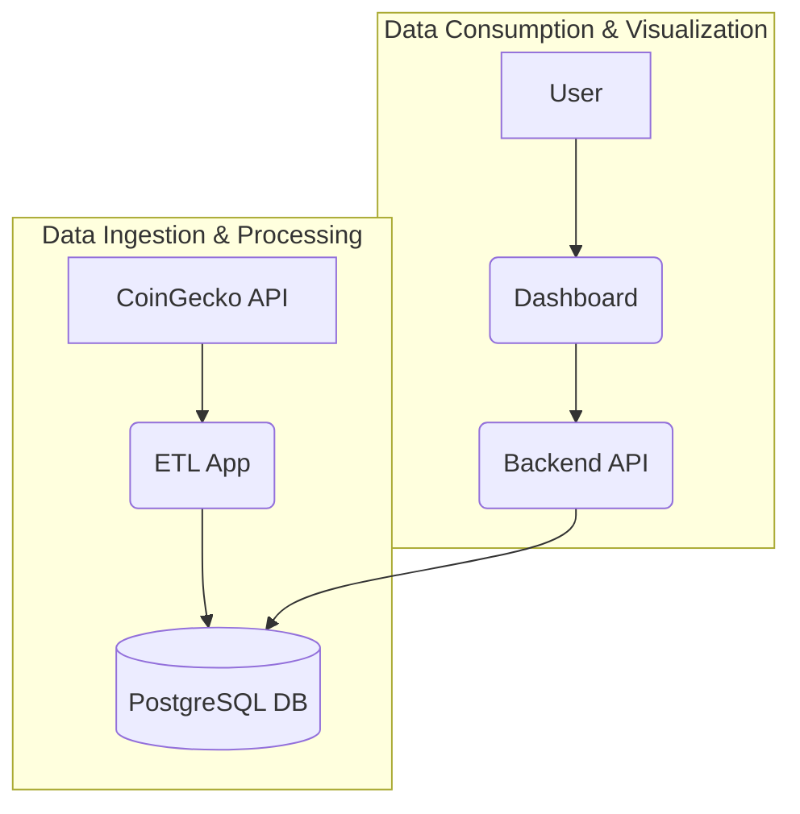

# Crypto ETL Pipeline & Dashboard


--- 

## Table of Contents

- [Project Overview](#project-overview)
- [Features](#features)
- [Architecture](#architecture)
- [Getting Started](#getting-started)
  - [Prerequisites](#prerequisites)
  - [Installation](#installation)
  - [Environment Variables](#environment-variables)
- [Usage](#usage)
  - [Running with Docker Compose (Recommended)](#running-with-docker-compose-recommended)
  - [Running ETL Steps Manually (within Docker)](#running-etl-steps-manually-within-docker)
  - [Accessing API & Dashboard](#accessing-api--dashboard)
  - [Running Locally (Advanced/Development)](#running-locally-advanceddevelopment)
- [Quality Attributes & Best Practices](#quality-attributes--best-practices)
  - [Idempotency](#idempotency)
  - [Error Handling & Resilience](#error-handling--resilience)
  - [Environment Drift Prevention](#environment-drift-prevention)
  - [Clarity, Maintainability, Reusability](#clarity-maintainability-reusability)
  - [Testing](#testing)
  - [Collaboration](#collaboration)
- [Scalability & Performance Considerations](#scalability--performance-considerations)
- [Future Enhancements](#future-enhancements)
- [Contributing](#contributing)
- [License](#license)
- [Contact](#contact)

--- 

## Project Overview

This project provides a robust and scalable ETL (Extract, Transform, Load) pipeline for fetching real-time cryptocurrency data from the CoinGecko API, transforming it, and persisting it into a PostgreSQL database. Complementing the data pipeline, it features a high-performance REST API built with FastAPI and an interactive web dashboard powered by Streamlit, enabling seamless data exploration and sharing.

Designed with best practices in mind, this solution emphasizes clarity, maintainability, reusability, and resilience, making it suitable for both analytical insights and as a foundation for more complex data applications.

## Features

-   **Data Extraction:** Fetches top 50 cryptocurrency data from CoinGecko API.
-   **Data Transformation:** Cleans, processes, and enriches raw data (e.g., adds time-series features).
-   **Data Loading:** Persists cleaned data into a PostgreSQL database using SQLAlchemy ORM.
-   **Data Validation:** Includes checks for missing values and data type consistency.
-   **Data Visualization:** Generates various charts (market share, price bars, candlestick, correlation plots).
-   **RESTful API:** Provides programmatic access to processed crypto data via FastAPI endpoints.
-   **Interactive Dashboard:** A Streamlit web application for visual data exploration and insights.
-   **Containerized Environment:** Full setup (DB, ETL, API, Dashboard) managed with Docker and Docker Compose for consistent environments.
-   **Robustness:** Implements idempotency, comprehensive error handling with retries, and environment drift prevention.
-   **Code Quality:** Adheres to best practices for clarity, maintainability, reusability, and testability.

## Architecture

The project follows a modular architecture, leveraging Docker Compose to orchestrate its core components:

-   **`db` service (PostgreSQL):** The persistent data store for all processed cryptocurrency information.
-   **`app` service (Python ETL):** Contains the core ETL logic (`etl.py`) responsible for data extraction, transformation, and loading into the `db`.
-   **`api` service (FastAPI):** A lightweight and high-performance web API (`api.py`) that exposes the data from the `db` service via RESTful endpoints.
-   **`dashboard` service (Streamlit):** An interactive web application (`dashboard.py`) that consumes data from the `api` service and provides visualizations and exploration tools.



## Getting Started

These instructions will get you a copy of the project up and running on your local machine.

### Prerequisites

-   [Docker Desktop](https://www.docker.com/products/docker-desktop) (includes Docker Engine and Docker Compose)

### Installation

1.  **Clone the repository:**
    ```bash
    git clone https://github.com/your-username/crypto-etl-pipeline.git
    cd crypto-etl-pipeline
    ```

2.  **Build and Start the Services:**
    This command will build the Docker images, set up the network, and start all services (PostgreSQL, ETL app, FastAPI, Streamlit dashboard).
    ```bash
    docker-compose up --build
    ```
    _Note: If you encounter a `port is already allocated` error, ensure no other applications are using ports `5432`, `8000`, or `8501` on your host machine. You might need to stop conflicting processes or change port mappings in `docker-compose.yml`._

### Environment Variables

Copy the provided example environment file and update it with your PostgreSQL credentials. This file is crucial for the database connection and should **not** be committed to version control if it contains sensitive information.

```bash
cp .env.example .env
```

Edit the newly created `.env` file:

```ini
POSTGRES_USER=your_postgres_user
POSTGRES_PASSWORD=your_postgres_password
POSTGRES_DB=crypto
POSTGRES_HOST=db
POSTGRES_PORT=5432
```

## Usage

### Running with Docker Compose (Recommended)

Once you've followed the [Installation](#installation) steps and configured your [.env](#environment-variables) file, all services will be running.

### Running ETL Steps Manually (within Docker)

You can execute individual ETL steps inside the running `app` container. This is useful for populating the database or re-running specific parts of the pipeline.

1.  **Extract Data:** Fetches data from CoinGecko and saves it to `raw.json`.
    ```bash
    docker-compose run app python etl.py extract --save_path=raw.json
    ```

2.  **Transform Data:** Cleans and transforms `raw.json` into `crypto_top_50.csv`.
    ```bash
    docker-compose run app python etl.py transform --input_path=raw.json --output_path=crypto_top_50.csv
    ```

3.  **Load Data:** Loads `crypto_top_50.csv` into the PostgreSQL database.
    ```bash
    docker-compose run app python etl.py load --csv_path=crypto_top_50.csv
    ```

4.  **Generate Visualizations:** Creates image files of charts.
    ```bash
    docker-compose run app python etl.py visualize --csv_path=crypto_top_50.csv
    docker-compose run app python etl.py candlestick --csv_path=crypto_top_50.csv --coin_name=bitcoin --save_path=bitcoin_candlestick.png
    docker-compose run app python etl.py correlation --csv_path=crypto_top_50.csv --save_path=correlation_plot.png
    ```

5.  **Validate Data:** Runs data quality checks.
    ```bash
    docker-compose run app python etl.py validate --csv_path=crypto_top_50.csv
    ```

### Accessing API & Dashboard

Once `docker-compose up` is running, you can access the web interfaces:

-   **FastAPI Documentation (Swagger UI):** `http://localhost:8000/docs`
-   **FastAPI ReDoc:** `http://localhost:8000/redoc`
-   **Streamlit Dashboard:** `http://localhost:8501`

### Running Locally (Advanced/Development)

For local development without Docker Compose, you'll need to manage dependencies and services manually:

1.  **Install Dependencies:**
    ```bash
    python -m venv venv
    source venv/bin/activate  # On Windows: venv\Scripts\activate
    pip install -r requirements.txt
    ```
2.  **Start PostgreSQL:** Ensure a PostgreSQL instance is running and accessible (e.g., on `localhost:5432`). Configure your `.env` file accordingly.
3.  **Run ETL Steps:** Execute `python etl.py <command>` as needed.
4.  **Start FastAPI:**
    ```bash
    uvicorn api:app --host 0.0.0.0 --port 8000
    ```
5.  **Start Streamlit Dashboard:**
    ```bash
    streamlit run dashboard.py --server.port 8501 --server.address 0.0.0.0
    ```

## Quality Attributes & Best Practices

This project is built with a strong emphasis on software engineering best practices to ensure its reliability, maintainability, and extensibility.

### Idempotency

The ETL pipeline is designed to be **idempotent**. This means that executing any step or the entire pipeline multiple times with the same inputs will produce the same output or result in the same final state. This is achieved through:
-   Overwriting output files (`.json`, `.csv`, `.png`).
-   Using `if_exists='replace'` for database table loading.

### Error Handling & Resilience

Robust error handling is crucial for a reliable data pipeline:
-   **API Calls:** `fetch_top_50_cryptos` uses `requests.exceptions.RequestException` and `tenacity` for retries with exponential backoff, making it resilient to transient network or API issues.
-   **Database Operations:** SQLAlchemy handles database-specific errors, and the `load` method includes checks for missing credentials.
-   **Logging:** Comprehensive logging (`etl.log`, `api.log`) provides visibility into execution flow, warnings, and errors.
-   **Data Validation:** The `validate_data` function performs checks and logs warnings for non-critical issues while raising errors for critical data quality problems.

### Environment Drift Prevention

Consistency across development, testing, and production environments is ensured through:
-   **Containerization:** Docker and Docker Compose encapsulate the entire application stack, guaranteeing identical runtime environments.
-   **Dependency Management:** `requirements.txt` pins exact Python package versions, and virtual environments isolate dependencies.
-   **Configuration Management:** `.env` files (with a `.env.example` template) manage environment-specific variables, preventing hardcoding.

### Clarity, Maintainability, Reusability

-   **Clarity:** Achieved through extensive **type hinting**, clear **docstrings**, descriptive **naming conventions**, and consistent **code style** enforced by `ruff`.
-   **Maintainability:** Facilitated by a **modular design**, externalized **configuration**, and a focus on **automated testing**.
-   **Reusability:** Promoted by highly **parameterized functions**, a **class-based structure** (`CryptoETLPipeline`), and a **RESTful API** that decouples data access from the ETL process.

### Testing

This project includes automated tests to ensure correctness and reliability:
-   **Unit Tests:** Basic unit tests for core functions are implemented using `pytest` and `requests-mock` for mocking external dependencies.
-   **Test Data:** Representative test data is used for consistent and reproducible test runs.

_For more details on running tests and linting, refer to the [Testing and Linting](#testing-and-linting) section._

### Collaboration

-   **Version Control:** The project is designed for Git-based collaboration.
-   **Comprehensive Documentation:** This `README.md` serves as a central guide for contributors.
-   **Modular Design & Containerization:** Allows multiple developers to work independently on different components without environment conflicts.

## Scalability & Performance Considerations

To manage significant data volume increases and ensure long-term robustness:

### Database Optimization (PostgreSQL)
-   **Indexing:** Crucial for query performance on large datasets.
-   **Partitioning:** Divide large tables into smaller, manageable pieces.
-   **Connection Pooling:** Efficiently manage database connections.
-   **Hardware Scaling & Configuration Tuning:** Optimize PostgreSQL parameters and server resources.
-   **Regular Maintenance:** Perform routine `VACUUM`, `ANALYZE`, and reindexing.

### ETL Process Efficiency (Python Script)
-   **Batch Processing/Chunking:** Process data in smaller chunks, especially for loading into the database (`pandas.DataFrame.to_sql` `chunksize`).
-   **Error Handling and Retries:** Enhance resilience to transient issues.
-   **Efficient Data Structures:** Consider Dask or PySpark for out-of-memory datasets.
-   **Logging and Monitoring:** Leverage comprehensive logging and integrate with monitoring tools.
-   **Resource Management:** Optimize memory and CPU usage.

### Data Retention and Archiving
-   **Data Warehousing:** Move historical data to dedicated analytical stores.
-   **Archiving to Cheaper Storage:** Store rarely accessed data in cost-effective solutions (e.g., S3).
-   **Data Lifecycle Management:** Define policies for data retention and purging.

## Future Enhancements

This project provides a solid foundation, and several areas can be explored for further development:

-   **Historical Data Tracking:** Implement fetching and storing historical cryptocurrency data to enable time-series analysis and more advanced visualizations.
-   **Orchestration:** Integrate with a dedicated workflow orchestration tool (e.g., Apache Airflow, Prefect, Dagster) for robust scheduling, dependency management, and monitoring of ETL jobs.
-   **Advanced Monitoring & Alerting:** Set up real-time dashboards and automated alerts for pipeline health, performance metrics, and data quality issues.
-   **Data Quality Framework:** Implement a more sophisticated data quality framework (e.g., Great Expectations) with defined rules and automated checks at various pipeline stages.
-   **CI/CD Pipeline Automation:** Automate building, testing, and deployment processes using tools like GitHub Actions or GitLab CI/CD.
-   **User Authentication/Authorization:** Add security layers to the API and dashboard if exposed publicly.
-   **More Granular Data:** Explore fetching minute-by-minute or second-by-second data for deeper analysis.
-   **Predictive Analytics/Machine Learning:** Develop and integrate models for price forecasting or anomaly detection.
-   **Integration with Other Data Sources:** Incorporate external data (e.g., news sentiment, macroeconomic indicators) to enrich analysis.

## Contributing

Contributions are welcome! If you have suggestions for improvements, bug fixes, or new features, please feel free to:

1.  Fork the repository.
2.  Create a new branch (`git checkout -b feature/YourFeature`).
3.  Make your changes.
4.  Ensure tests pass and code adheres to style guidelines.
5.  Commit your changes (`git commit -m 'feat: Add new feature'`).
6.  Push to the branch (`git push origin feature/YourFeature`).
7.  Open a Pull Request.

## License

This project is licensed under the MIT License - see the [LICENSE](LICENSE) file for details.

## Contact

For questions or support, please open an issue in the GitHub repository.
